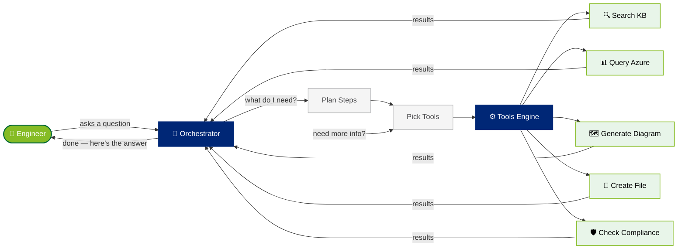
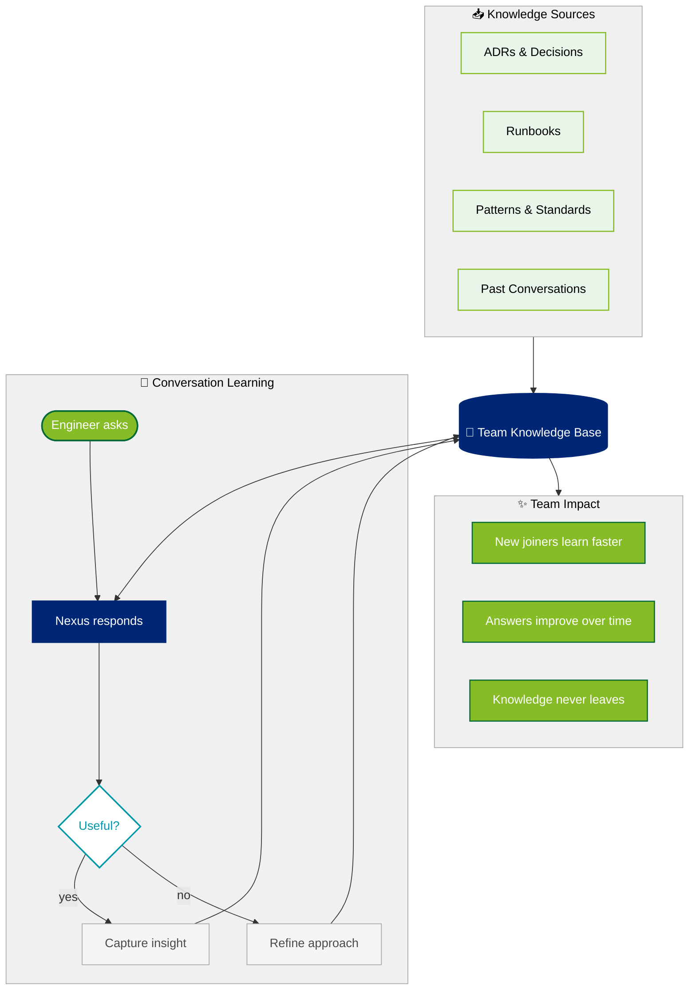
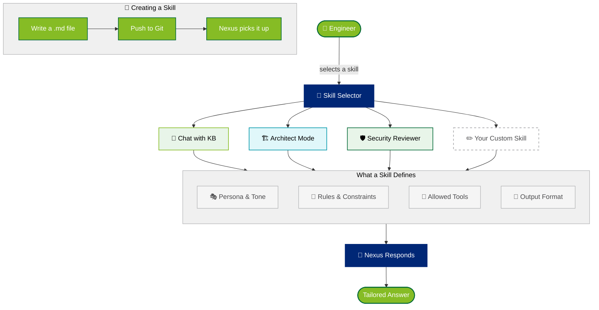
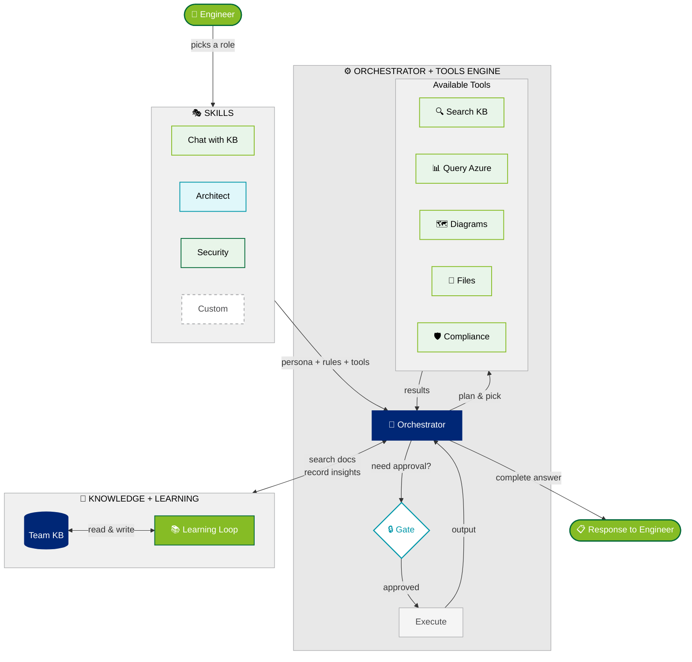

# Nexus — How It Works

Visual overview of the three core systems that power Nexus, and how they connect.

---

## 1. Tools Engine & Orchestrator

When an engineer asks a question, the Orchestrator figures out *what to do* and the Tools Engine *does it* — looping up to 15 times until the answer is complete.

> **Key idea**: The Orchestrator doesn't just call one tool — it *reasons* about which tools to chain together, reviews intermediate results, and keeps going until the question is fully answered.

---

## 2. How Learning Works

Nexus gets smarter every time it's used. Knowledge flows in from team contributions *and* from conversations — building a living memory that the whole team benefits from.

> **Key idea**: Nexus doesn't just answer from static docs — it learns from every interaction. The more your team uses it, the smarter it gets.

---

## 3. How Skills Work

A Skill is a markdown file that tells Nexus *who to be*, *how to think*, and *what tools to use*. Switching skills completely changes Nexus's behaviour — like giving it a new role.

> **Key idea**: Skills are just markdown. Any engineer can create one — no code, no deploy. Your team's best practices become living, enforceable AI behaviour.

---

## 4. Combined — The Full Picture

How all three systems connect: Skills shape *who* Nexus is, the Orchestrator & Tools Engine handle *what* it does, and Learning makes it *smarter over time*.

> **The full loop**: An engineer picks a Skill (shaping Nexus's persona), asks a question, the Orchestrator plans and calls tools, checks the Knowledge Base, asks for approval when needed, delivers the answer — and records what it learned for next time. Every cycle makes Nexus smarter.

---

*Nexus Concept Diagrams — May 2026*
